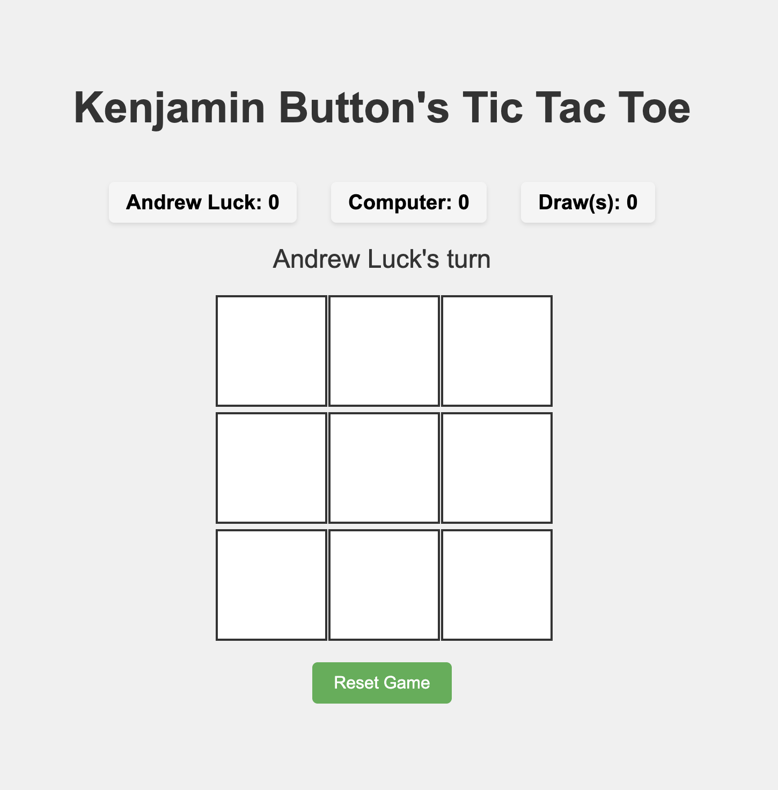

<div align="center">
  <h1>Kenjamin Button's Tic Tac Toe Game</h1>

  <h3>A Classic Game with Modern Features</h3>

  <p align="center">
    <h2>
      <a href="https://tic-tac-tac.vercel.app/" style="font-size: 24px;">
        🎮 PLAY LIVE DEMO 🎮
      </a>
    </h2>
    <br />
    A modern, thoroughly tested implementation of the classic Tic Tac Toe game using HTML, CSS, and JavaScript.
    Complete with comprehensive Jest test coverage and professional development practices.
    <br />
    <a href="https://github.com/KenjaminButton/tic-tac-tac"><strong>Explore the docs »</strong></a>
    <br />
    <br />
    <a href="https://github.com/KenjaminButton/tic-tac-tac/issues">Report Bug</a>
    ·
    <a href="https://github.com/KenjaminButton/tic-tac-tac/issues">Request Feature</a>
  </p>
</div>

## About The Project

A modern, web-based implementation of the classic Tic Tac Toe game. This project features a clean, responsive design, smooth gameplay mechanics, and comprehensive test coverage using Jest. Players can enjoy the timeless game of X's and O's in their web browser, backed by robust code quality and testing practices.

### Screenshots

<div align="center">
  <h3>Player Name Selection</h3>
  
  
  <h3>Gameplay</h3>
  
  
  <h3>Winning Celebration</h3>
  
</div>

### Features

#### Game Mechanics
* Smart computer opponent with natural move delays
* Player choice of X or O symbol
* Automatic win and draw detection
* Real-time game state tracking
* Quick game reset functionality

#### User Interface
* Clean and modern design
* Responsive layout for all devices
* Interactive cell hover effects
* Animated button feedback
* Clear turn indicators

#### Player Experience
* Personalized gameplay with custom names
* Live score tracking system
* Separate counters for wins, losses, and draws
* Visual winning line indication
* Celebratory confetti animation on wins

#### Technical Implementation
* Pure JavaScript without external dependencies
* Efficient game state management
* Modular code structure
* Fast loading and performance
* Cross-browser compatibility
* Comprehensive Jest test suite
* Test-driven development approach
* 100% core feature test coverage

### Built With

* 
* 
* 
* 

## Getting Started

To get a local copy up and running, follow these simple steps.

### Prerequisites

* A modern web browser (Chrome, Firefox, Safari, or Edge)
* A text editor if you want to modify the code (VS Code recommended)
* Node.js and npm for running tests

### Installation

1. Clone the repo
   ```sh
   git clone https://github.com/KenjaminButton/tic-tac-tac.git
   ```
2. Navigate to the project directory
   ```sh
   cd tic-tac-tac
   ```
3. Install dependencies
   ```sh
   npm install
   ```
4. Run tests
   ```sh
   npm test
   ```
5. Open index.html in your web browser
   ```sh
   open index.html
   ```

## Usage

1. Open the game in your web browser
2. Players take turns clicking on the grid to place their X or O
3. The game will automatically detect wins or draws
4. Click the reset button to start a new game

## Testing

The project uses Jest for comprehensive testing of all game functionality. The test suite covers:

### Game Setup Tests
- Player name validation
- Symbol (X/O) selection
- Game board initialization
- Initial state verification

### Game Mechanics Tests
- Valid move placement
- Invalid move prevention
- Computer move generation
- Turn alternation
- Board state management

### Win Detection Tests
- Horizontal win patterns
- Vertical win patterns
- Diagonal win patterns
- Draw game scenarios
- Win celebration triggers

### Score Tracking Tests
- Player score increments
- Computer score increments
- Draw count tracking
- Score persistence after reset

### Event Handler Tests
- DOM event listener initialization
- Player input handling
- Game board click responses
- Reset button functionality

### Running Tests
```sh
# Run all tests
npm test

# Run tests in watch mode (for development)
npm run test:watch
```

All tests are located in `script.test.js` and use Jest's testing environment with jsdom for DOM manipulation.

## Deployment

The game is live and playable at: [Tic Tac Toe Live Demo](https://tic-tac-tac.vercel.app/)

Hosted using [Vercel](https://vercel.com/), providing:
* Fast loading times
* Automatic HTTPS
* Global CDN distribution
* Zero-configuration deployment

## Roadmap

Our development journey followed these major milestones:

### Phase 1: Core Game Implementation 
- [x] Create basic game board layout
- [x] Implement cell click handlers
- [x] Add game state management
- [x] Develop win detection algorithm
- [x] Add draw game detection
- [x] Implement game reset functionality

### Phase 2: Player Experience 
- [x] Add player name input
- [x] Create symbol selection (X/O)
- [x] Implement turn indicators
- [x] Add game status messages
- [x] Create score tracking system
- [x] Display player names in scoreboard

### Phase 3: Computer Opponent 
- [x] Implement computer move logic
- [x] Add delay for natural gameplay feel
- [x] Ensure computer uses correct symbol
- [x] Handle computer win scenarios
- [x] Prevent player moves during computer turn

### Phase 4: Visual Enhancements 
- [x] Add winning line visualization
- [x] Implement confetti celebration
- [x] Style score board display
- [x] Create responsive design
- [x] Add hover effects on cells
- [x] Improve button animations

### Phase 5: Score System 
- [x] Track player wins
- [x] Track computer wins
- [x] Count draw games
- [x] Persist scores during session
- [x] Display real-time score updates

### Phase 6: Testing Implementation
- [x] Set up Jest testing environment
- [x] Write comprehensive test suite
- [x] Test game setup functionality
- [x] Test game move mechanics
- [x] Test win/draw detection
- [x] Test score tracking system
- [x] Test event listener behavior
- [x] Achieve 100% test coverage for core features

### Future Enhancements 
- [ ] Add sound effects
- [ ] Implement difficulty levels
- [ ] Save high scores
- [ ] Add multiplayer support
- [ ] Create game statistics
- [ ] Add theme customization

See the [open issues](https://github.com/KenjaminButton/tic-tac-tac/issues) for a full list of proposed features and known issues.

## Contributing

Contributions are what make the open source community such an amazing place to learn, inspire, and create. Any contributions you make are **greatly appreciated**.

1. Fork the Project
2. Create your Feature Branch (`git checkout -b feature/AmazingFeature`)
3. Commit your Changes (`git commit -m 'Add some AmazingFeature'`)
4. Push to the Branch (`git push origin feature/AmazingFeature`)
5. Open a Pull Request

## License

Distributed under the MIT License. See `LICENSE` for more information.

## Contact

Kenneth Chang - [@KenjaminButton](https://kenjaminbutton.com/contact)

Project Link: [https://tic-tac-tac.vercel.app/](https://tic-tac-tac.vercel.app/)

## Acknowledgments

* [Font Awesome](https://fontawesome.com) - for icons
* [Shields.io](https://shields.io) - for README badges
* [GitHub Pages](https://pages.github.com) - for hosting
